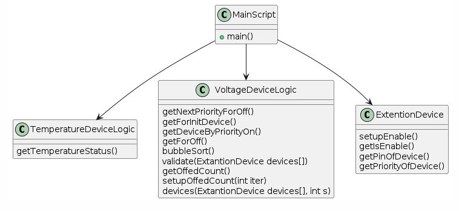

# Introduction

## Purpose
The purpose of this document is to describe the Battery Temperature Status Monitoring System based on Arduino. The program was written in Visual Studio Code with the Wokwi package and consists of four scripts: the main script, a script for temperature device logic, a script for voltage device logic, and a script handling the disconnection logic of a third-party device.

## References 
- Arduino Documentation: https://www.arduino.cc/en/Reference/HomePage
- Wokwi Arduino Simulator: https://wokwi.com/
- Visual Studio Code: https://code.visualstudio.com/

# Terminology 

## Definitions

| Term                  | Definition                                                    |
|-----------------------|---------------------------------------------------------------|
| Temperature Device    | A sensor device that measures the temperature of the battery. |
| Voltage Device        | A sensor device that measures the voltage of the battery.     |
| Disconnection Logic   | Logic handling the disconnection of a third-party device.     |
| Wokwi Package         | A simulation tool for Arduino projects.                       |

## Abbreviations

| Abbreviation | Description                                    |
|--------------|------------------------------------------------|
| VS Code      | Visual Studio Code                             |
| MCU          | Microcontroller Unit                           |
| I/O          | Input/Output                                   |
| GUI          | Graphical User Interface                       |

# System Overall Description 

## Product Overview
The Battery Temperature Status Monitoring System monitors the temperature and voltage of a battery in real-time. It can automatically disconnect third-party devices if certain conditions are met, ensuring the safety and efficiency of the battery system.

## Product Functions
The system comprises the following functions:
- **Main Script**: Coordinates the overall operation of the system.
- **Temperature Device Logic**: Includes the function  `getTemperatureStatus` to retrieve the current temperature.
- **Voltage Device Logic**: Includes functions `Validate(ExtantionDevice devices[])`, `GetOffedCount()`,`SetupOffedCount(int iter)`,`Devices(ExtantionDevice devices[], int s)`, `getNextPriorityForOff`, `getForInitDevice`, `getDeviceByPriorityOn`, and `getForOff` for managing voltage-related operations.
- **Disconnection Logic**: Includes functions `setupEnable`, `getIsEnable`, `getPinOfDevice`, and `getPriorityOfDevice` for handling the disconnection of third-party devices.
## Scheme of the System Architecture of the Project

## Schemes of project components.

## Constraints
### Implementation Restrictions
- The system must be implemented using Arduino and compatible sensors.
- The Wokwi package should be used for simulation and testing.
- Visual Studio Code is the recommended development environment.

### Resource Limits
- Limited by the processing power and memory of the Arduino MCU.
- Limited number of I/O pins for connecting sensors and devices.

### Data Limits
- Temperature and voltage readings are constrained by the sensor specifications.
- Data storage is limited to the memory available on the Arduino.

## Assumptions and Dependencies
- The sensors used (temperature and voltage) are compatible with the Arduino.
- The third-party device to be disconnected can be controlled via a relay module.
- The system is dependent on the proper functioning of the Wokwi simulation environment for testing.

# Specific Requirements

## Interfaces
- **Sensor Interfaces**: Defined pin connections for the temperature and voltage sensors.
- **Relay Interface**: Pin connection and control logic for the relay module.
- **Display Interface**: Communication protocol (e.g., I2C) for the LCD display.

## Functional Requirements
- The system must read temperature and voltage data at regular intervals.
- The system should update the LCD display with the latest readings and status.
- The system must automatically disconnect third-party devices if the temperature or voltage exceeds predefined thresholds.
- The disconnection logic must be configurable via software.

# Data Requirements
- Temperature readings must be logged with a precision of ±0.5°C.
- Voltage readings must be logged with a precision of ±0.1V.
- Disconnection events must be recorded with a timestamp for analysis.

